# Processing

The goal of this tutorial is to explain how to processing the residuals
obtained with `DIVAnd` using `Ocean Data View` (ODV).

In this example:
* __File:__ `Water body phosphate_monthly_residuals.nc` (monthly residuals of
	phosphate concentration).
* __ODV version:__ 5.4.0 (downloaded March 2021)


## Procedure

### 1. Open the netCDF file containing the residuals

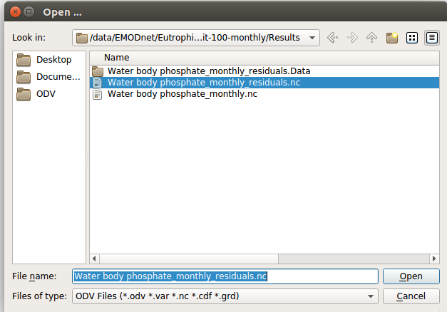

### 2. Follow the _Wizard_ steps

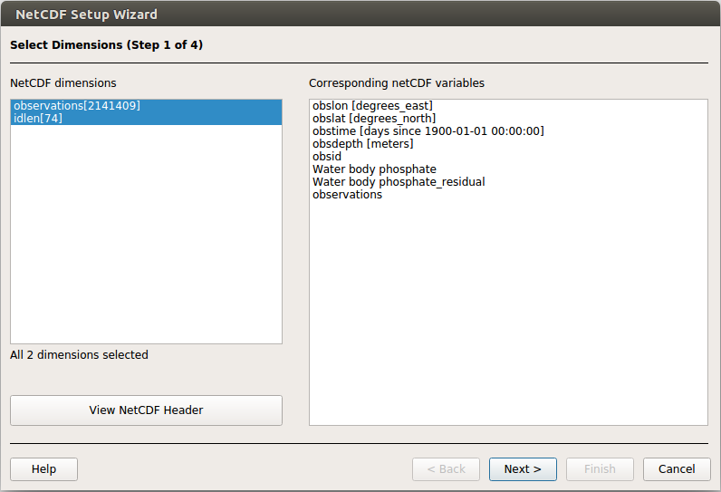

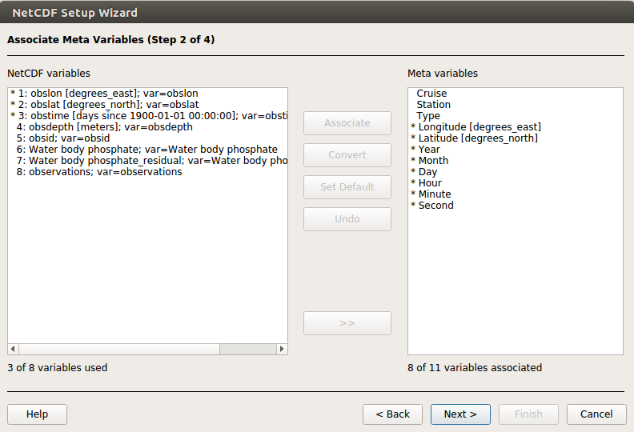

#### Use decimal date (or dummy variable) as _Primary variable_
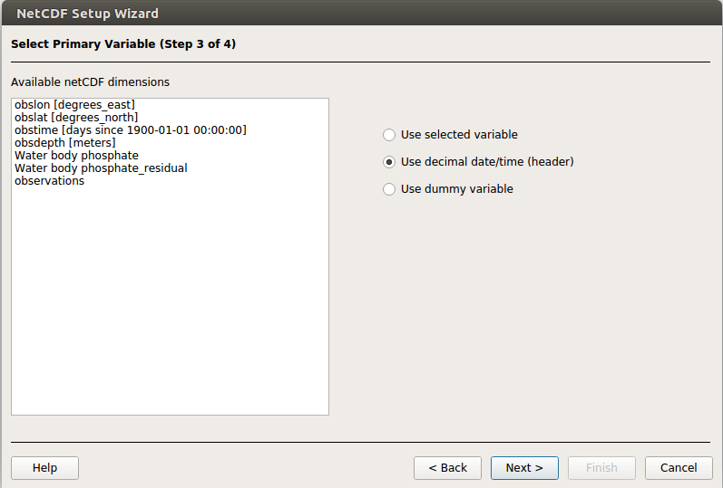

#### Finish the netCDF setup
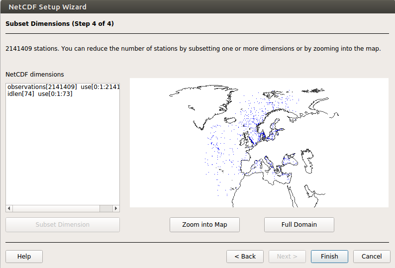

### 3. Select a _SURFACE Window_ in _Views/Layout Templates_

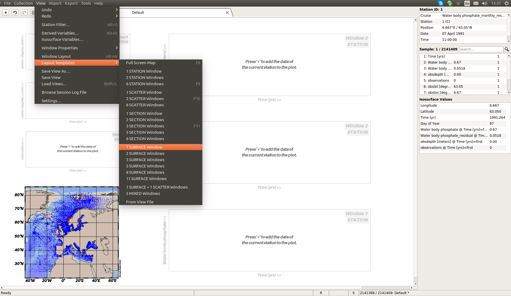

Result of the _Surface Window_. Here you can change the dot size (in _Properties_) and other details according to your preferences.

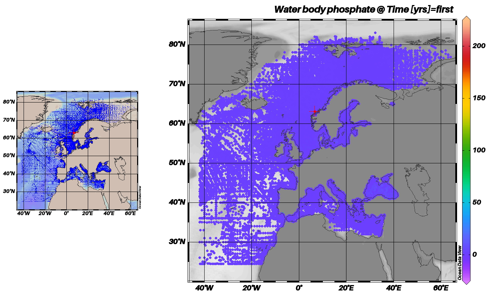

### 4. Set the z-variable as the residuals

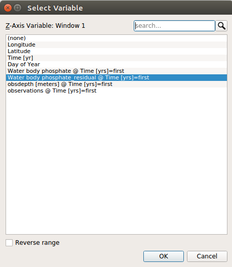

Set the ranges for the residuals, for instance between -5. and 5.

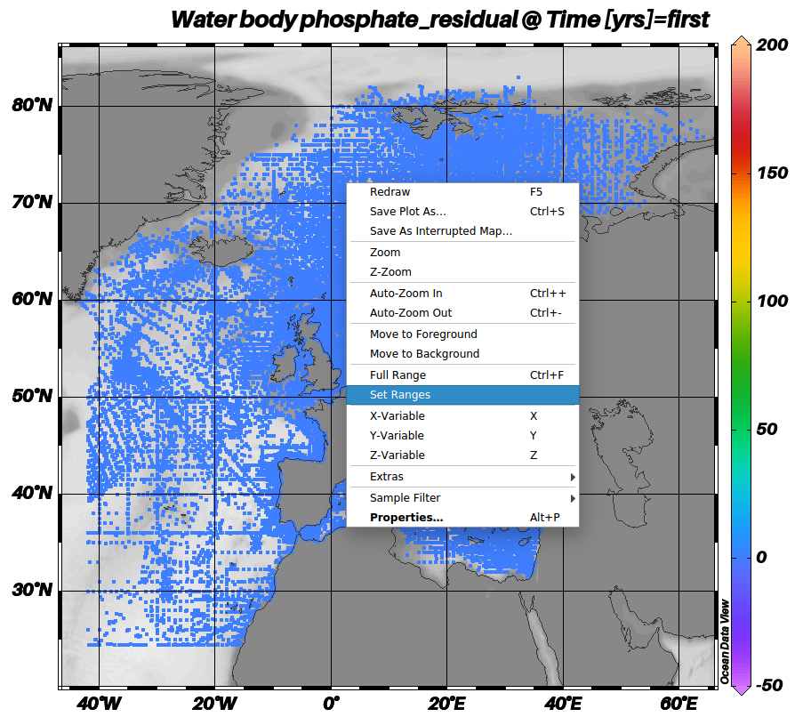
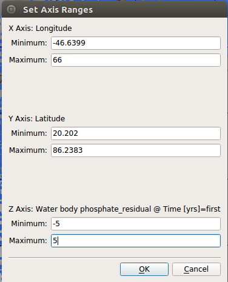

### 5. Use the sample filter to display only the points with a high value for the residual

#### For example we show residuals above 5
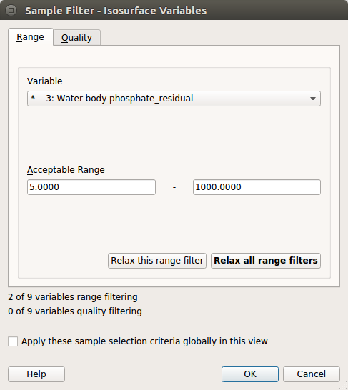

#### Example of what is obtained with the filter
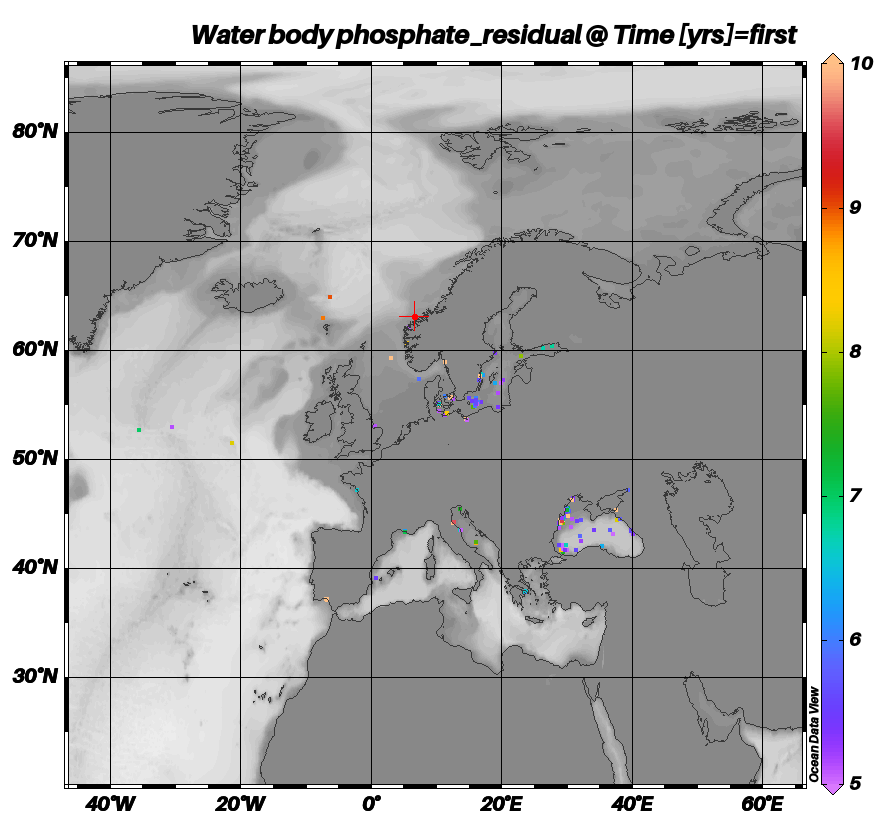

### 6. Select your region of interest using the _Set ranges_ tool
s
In this case we can see the measurements in the _Black Sea_ for which the residuals exceed a concentration of 5 µmol/l.

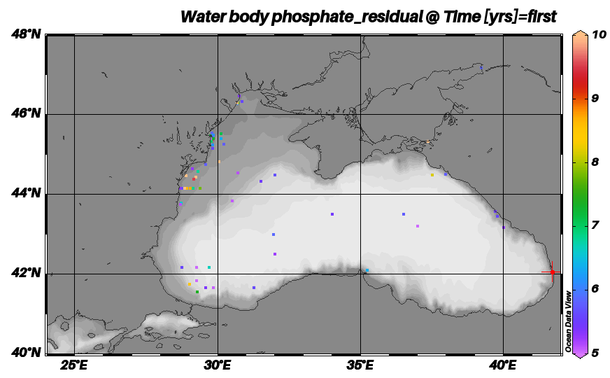


## Post-processing

The goal is to obtain a list of identifier (`obsid`) that will be black-listed
for the next round of analysis. We can either store the identifiers (only), or
keep also the other variables (position, time, depth) if we don't want to remove a whole
profile.

Starting from a CSV file, it is straightforward to work with `awk`:

* To list identifiers for which the residuals is above a given value
```bash
awk -F "," '$7 > 50.0 {print $5}' inputfile > blacklist.txt
```

* To list identifiers of the data that have been excluded (last column set to __1__):
```bash
awk -F "," '$8 == 1 {print $5}' inputfile > excludelist.txt
```

* If we need to combine several conditions (`||` = or; `&&` = and):
```bash
awk -F "," '($7 > 150.0) || ($7 < -115.) { print $5}' inputfile > excludelist.txt


__Notes:__

- In some cases, the separator can be the semicolon `;`.`
- If we want to print more than one column:
```bash
awk -F  ";" '$8 == 1 {print $1, $2, $3, $4, $5}' inputfile > excludelist.txt
```


### User notes

#### Arctic

Files for all the variables, except DIN, were prepared by the regional leader.

Note that the order of the column is slightly different.
(print $2, $3, $5, $1, $4)

#### Atlantic
Phosphate, silicate and nitrogen were prepared by the regional leader.

* Oxygen:
> Remove data for which residuals > 150 and < -115.

* Chlorophyll:
> exclude points with residuals > 50

#### Baltic Sea
All the variables were processed by the regional leader and the files sent to us.

#### Black Sea
Same.
