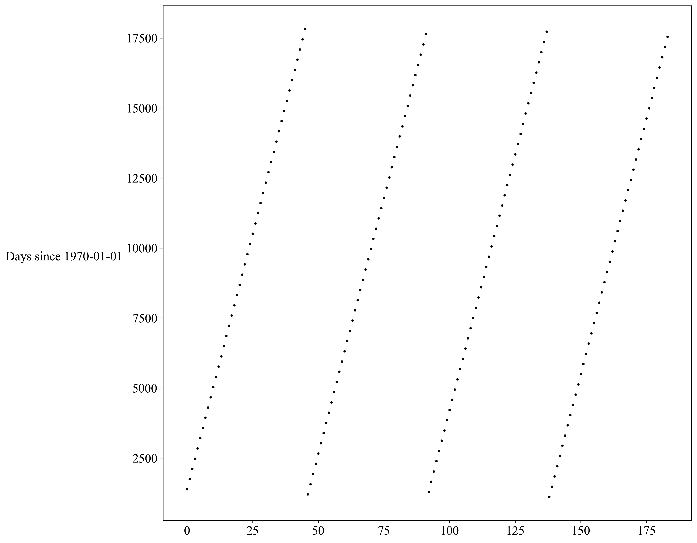
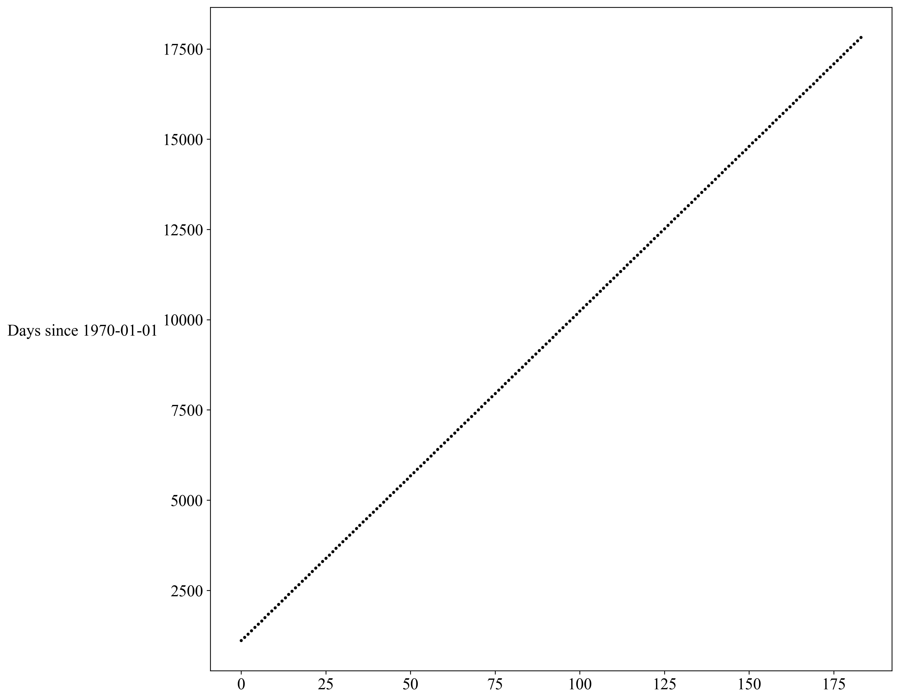

# Processing

The goal of this tutorial is to explain how to create a unique netCDF file from
several netCDF corresponding, for instance,
* to different seasons of the same variable or
* an old product and a new product (new time period).
In addition, we will ensure that the time periods are sorted in the final file.

__Tools:__
* [`nco`](http://nco.sourceforge.net/), the netCDF Operators toolkit. The tools is more
easily installed on Linux, but for Windows it might require more time.
* [`Julia`](julialang.org/), your favorite programming language!

__Files:__
We assume we have at our disposal 4 files corresponding to 4 seasons:
* `Water_body_dissolved_oxygen_concentration_Autumn.4Danl.nc`
* `Water_body_dissolved_oxygen_concentration_Spring.4Danl.nc`
* `Water_body_dissolved_oxygen_concentration_Summer.4Danl.nc`
* `Water_body_dissolved_oxygen_concentration_Winter.4Danl.nc`

## Procedure

### Step 1: add record variable

Before merging the files, it is necessary to add a _record variable_ (usually the time),
that will be used for the concatenation. This is done with the `ncks` tool:

```bash
ncks -O --mk_rec_dmn time Water_body_dissolved_oxygen_concentration_Autumn.4Danl.nc Water_body_dissolved_oxygen_concentration_Autumn.4Danl.nc
```
where `-O` means that we overwrite the (existing) output file.     
We can see the difference in the file before and after this operation, using `ncdump -h`:

__Before:__
```bash
dimensions:
	lon = 310 ;
	lat = 160 ;
	depth = 12 ;
	time = 3 ;
...
```
__After:__
```bash
dimensions:
	time = UNLIMITED ; // (3 currently)
	depth = 12 ;
	lat = 160 ;
	lon = 310 ;
  ...
```
We see that now the time dimension is _unlimited_: it is the record variable, which will
be used for the merging.

__Note:__ if you want to apply the operations to a large number of files, you may want to
use a loop.


### Step 2 [optional for season merging]: remove common time periods

It is possible that one or several time periods appear in the different files if, for instance the last period of the old climatology is be the same as the first period of the new file.

It is obviously not the case when one has to merge seasonal files into yearly files.

Let's assume we want to remove the last time period of the old file, we do:
```bash
ncks -d time,0,40 oldfile.nc oldfile.nc
```
We check the time dimension (again with `ncdump -h`):
```
time = UNLIMITED ; // (41 currently)
```

### Step 3: merge the files

We use the `ncrcat` operator, designed to concatenate record variables across an arbitrary number of input files. We could do:
```bash
ncrcat Water_body_dissolved_oxygen_concentration_*nc Water_body_dissolved_oxygen_concentration_year.nc
```
which will create a new file `Water_body_dissolved_oxygen_concentration_year.nc` using the 4 seasons, but doing so, the chronological order is not respected (with the wildcard "", the files are taken in alphabetical order). This is illustrated in the plot below:



Checking the dimensions with `ncdump -h Water_body_dissolved_oxygen_concentration_year.nc` gives:
```
...
time = UNLIMITED ; // (184 currently)
...
```

### Step 4: sort time

If the files were properly prepared, the time variable should already be sorted in
chronological order. If this is not the case, you can use the tool [`sort_times.jl`](../julia/product-merging/sort_times.jl) (a detailed example can be found in this [notebook](https://github.com/gher-ulg/SeaDataCloud/blob/master/Julia/sort_climatology_time.ipynb)).

1. Edit the file paths in the script
2. Run the script      
in bash
```bash
julia sort_times.jl
```
or in a Julia session:
```julia
julia> include("sort_times.jl")
```



__⌛__ this can take several minutes for a realistic example.

### Step 5: merge observations

When merging with `ncrcat`, we merged the files according to time. This means that
the variables that don't depend on time were not merged. This is the case for the observations, i.e. the variables `obslon`, `obslat`, ...

The old file has 192215 observations.      
The new file has 7362 observations.      
The 192215 observations of the first file are already written in the merged netCDF,
so we only need to read those from the new file and write them to the netCDF.

As the dimension is already fixed in the file, we cannot directly append the new observations.

__Solution:__ delete the variables that depends on the dimension `observations`:
```bash
ncks -x -v obslon,obslat,obsdepth,obstime,obsid Water_body_dissolved_oxygen_concentration_year.nc Water_body_dissolved_oxygen_concentration_year.nc
```

Once the variables have been removed, use the script [merge_obs.jl](https://github.com/gher-ulg/EMODnet-Chemistry/blob/master/julia/product-merging/merge_obs.jl) to merge the observations
from the 2 input files:
1. Adapt the paths of the files
2. Run the script      
in bash:
```bash
julia merge_obs.jl
```
or in a Julia session:
```julia
julia> include("merge_obs.jl")
```

⌛ this steps also takes several minutes (10' on my machine) for a realistic example
with more than 1 million observations.
